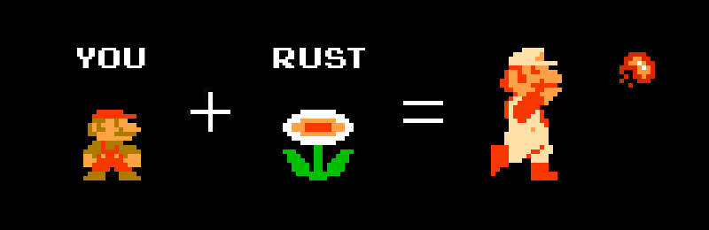

# Empowerment

If I had to summarize my entire experience with Rust so far in a single paragraph,
I would probably end up borrowing the words of Nicholas Matsakis and Aaron Turon:

> [...] the Rust programming language is fundamentally about empowerment: no matter what
kind of code you are writing now, Rust empowers you to reach farther, to program
with confidence in a wider variety of domains than you did before.

*The entire text can be found in the [Foreword](https://doc.rust-lang.org/book/foreword.html) section
of [The Book](https://doc.rust-lang.org/book/).*

Before discussing all the doors Rust can open,
and all the never-before-imagined domains behind them,
I'd like to first delve a little into this concept of "empowerment".

The image above comes from a [delightful portrait](https://brson.github.io/fireflowers/)
of the Rust community discussion at the very end of 2016, provided by Brian Anderson.
Voices back then pointed out that limiting Rust to its safety and low-level programming
capabilities wasn't enough, or at least, wouldn't be doing it the appropriate justice.
This is where the illustrated metaphor came from:
Rust should be seen as the Fire Flower that turns a regular Mario
into a badass fireball-throwing Mario.

For me, what makes Rust special is not just the "superpowers" it provides. It's
the confidence that comes with it. The certainty of delivering more reliable
code right out of the box, and sometimes even receiving a performance improvement as a
bonus. This is an experience that changes how you feel about your own code and 
about your capabilities. This is, for me, what "empowerment" is about.

The freedom that comes when the self-imposed barriers start to be demolished.
The fearless environment where major mistakes can be
caught even before compiling your code. And the guidance that prevents
disorientation or hopelessness when diving into a lower-level abstraction. This
is what "empowerment" feels like for me. And this, in my opinion, is what makes
Rust special and why it's one of the most loved languages ever.
